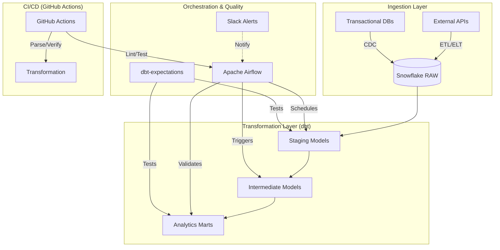

# Modern Data Analytics Pipeline (Data Mesh Foundation)

## Architecture Overview

This project implements a highly professional, enterprise-grade data analytics pipeline designed for scalability, reliability, and data quality. The architecture leverages a **Data Mesh Foundation** approach with modular domains and robust governance:

### Data Lineage

The pipeline follows a strict multi-layer transformation strategy:
1.  **Source (RAW)**: Landing zone for immutable raw data.
2.  **Staging (STG)**: Surgical cleaning, renaming, and type casting. Models are named `stg_<source>_<entity>.sql`.
3.  **Intermediate (INT)**: Complex business logic, cross-model joins, and heavy transformations. Models are named `int_<domain>_<logic>.sql`.
4.  **Marts (MART)**: Denormalized, user-facing tables optimized for BI tools (e.g., Tableau, Looker). Models are named `fct_<entity>.sql` or `dim_<entity>.sql`.

## CI/CD Strategy

Automated validation is enforced via GitHub Actions:
- **Linting**: SQL (sqlfluff) and Python (flake8) linting to ensure code consistency.
- **Validation**: `dbt parse` to catch syntax and dependency errors before deployment.
- **Testing**: Automated Python unit tests for custom operators and dbt logic.

## Project Structure

- `airflow/`: Contains DAGs for workflow orchestration.
- `dbt/`: The core transformation logic, including models, macros, and configuration.
- `snowflake/`: SQL scripts for database initialization and administrative tasks.
- `tests/`: Custom Python-based data quality tests using `pytest`.
- `requirements.txt`: Python dependencies for the project.

## Getting Started

1. Set up your Snowflake environment using the scripts in `snowflake/setup/`.
2. Install Python dependencies: `pip install -r requirements.txt`.
3. Configure your `profiles.yml` for dbt to connect to Snowflake.
4. Deploy the dbt models: `dbt run`.
5. Schedule the pipeline in Airflow.
